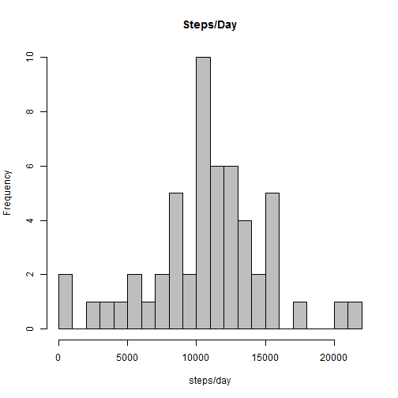
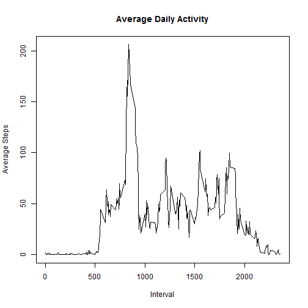
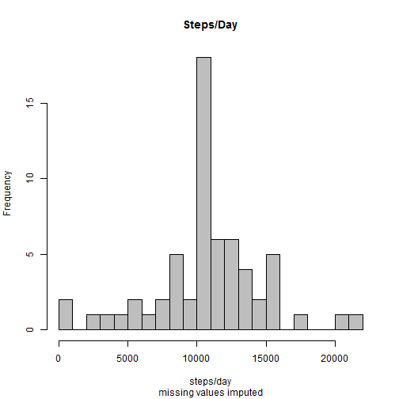
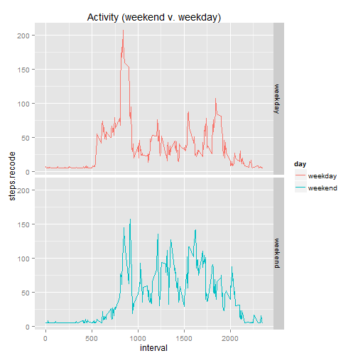

Project Assignment One-Reproducible Research  
=============================================  

## 1.Loading and Processing the data:  

The data is unzipped and read in as a csv file. The zipped file was obtained from the Repository.  

```r
unzip("./activity.zip")
data <- read.csv("./activity.csv", header=T,sep=",")
```
###Load packages and suppressWarnings 

```r
suppressWarnings(library(knitr))
suppressWarnings(library(lubridate))
suppressWarnings(library(dplyr))
```

```
## 
## Attaching package: 'dplyr'
## 
## The following objects are masked from 'package:lubridate':
## 
##     intersect, setdiff, union
## 
## The following object is masked from 'package:stats':
## 
##     filter
## 
## The following objects are masked from 'package:base':
## 
##     intersect, setdiff, setequal, union
```

```r
suppressWarnings(library(ggplot2))
```
###Brief Exploratory Data Analysis:

```r
head(data)
```

```
##   steps       date interval
## 1    NA 2012-10-01        0
## 2    NA 2012-10-01        5
## 3    NA 2012-10-01       10
## 4    NA 2012-10-01       15
## 5    NA 2012-10-01       20
## 6    NA 2012-10-01       25
```

```r
tail(data)
```

```
##       steps       date interval
## 17563    NA 2012-11-30     2330
## 17564    NA 2012-11-30     2335
## 17565    NA 2012-11-30     2340
## 17566    NA 2012-11-30     2345
## 17567    NA 2012-11-30     2350
## 17568    NA 2012-11-30     2355
```

```r
str(data)
```

```
## 'data.frame':	17568 obs. of  3 variables:
##  $ steps   : int  NA NA NA NA NA NA NA NA NA NA ...
##  $ date    : Factor w/ 61 levels "2012-10-01","2012-10-02",..: 1 1 1 1 1 1 1 1 1 1 ...
##  $ interval: int  0 5 10 15 20 25 30 35 40 45 ...
```

```r
summary(data)
```

```
##      steps                date          interval     
##  Min.   :  0.00   2012-10-01:  288   Min.   :   0.0  
##  1st Qu.:  0.00   2012-10-02:  288   1st Qu.: 588.8  
##  Median :  0.00   2012-10-03:  288   Median :1177.5  
##  Mean   : 37.38   2012-10-04:  288   Mean   :1177.5  
##  3rd Qu.: 12.00   2012-10-05:  288   3rd Qu.:1766.2  
##  Max.   :806.00   2012-10-06:  288   Max.   :2355.0  
##  NA's   :2304     (Other)   :15840
```
A few things can be pointed out.  The date variable is a factor,this needs to be changed to a date object.There are over 2,000 missing entries and this will need to be addressed or corrected in subsequent calculations. The average number of steps is 37. We will use this later.   
Change class of date variable:

```r
data$date <-as.character(data$date)
data$date <- ymd(data$date)
class(data$date)
```

```
## [1] "POSIXct" "POSIXt"
```

```r
str(data)
```

```
## 'data.frame':	17568 obs. of  3 variables:
##  $ steps   : int  NA NA NA NA NA NA NA NA NA NA ...
##  $ date    : POSIXct, format: "2012-10-01" "2012-10-01" ...
##  $ interval: int  0 5 10 15 20 25 30 35 40 45 ...
```
  
## 2.Mean total steps taken per day  
A new data frame is created df_1steps. The rows with NA are filtered out, it is grouped by the date and then the steps are summarized. This was done with ` dplyr`A histogram is created (the breaks are arbitrarily set to 25).  Then the mean and median are calculated.  

```r
df1_steps <- data %>%
        filter(!is.na(steps)) %>%
        group_by(date) %>%
        summarize(steps = sum(steps))
hist(df1_steps$steps, breaks=25, col="grey", main="Steps/Day", xlab="steps/day")
```

 

***Mean and median:***  

```r
mean_steps.day<-mean(df1_steps$steps)
median_step.day<-median(df1_steps$steps)

mean_steps.day
```

```
## [1] 10766.19
```

```r
median_step.day
```

```
## [1] 10765
```
The mean steps per day is **10766** , and the median is **10765** .  

##3. Average Daily Activity  
A second data frame is created df_2avgsteps. The missing values are filtered out. Now it is grouped by interval and the average of the steps is formed. A plot is  then constructed with `type="l"`. Finally the interval which on average contains the highest number of steps is determined.


```r
df2_avgSteps <- data %>%
        filter(!is.na(steps)) %>%
        group_by(interval) %>%
        summarize(steps = mean(steps))
plot(df2_avgSteps$interval,df2_avgSteps$steps, type="l",main="Average Daily Activity", ylab="Average Steps",xlab="Interval")
```

 

***Interval with the maximum steps***

```r
df2_avgSteps[which.max(df2_avgSteps$steps),]
```

```
## Source: local data frame [1 x 2]
## 
##   interval    steps
## 1      835 206.1698
```

The Interval with the highest number steps is **835**.

##4. Imputing Missing Data:  

The number of missing values was calculted earlier in the exploratory phase in the 5 number summary `summary()`. It was found to be **2304**.This is confirmed with the following code.

```r
missing<-is.na(data$steps)
missing_na<-sum(missing)
```
This confirms that the number of `NA` is: 2304


A third data frame is constructed df2_steps. This data frame has a fourth variable-steps.recode. The NA'S in the variable steps are replaced with 37. this is the mean value of all the steps variable.  It was determined in the 5 number summary obtained in the exploratory data section of this project.  This was done with the  `ifelse`. Using this function allows this to be done without the use of `for` loop, `if` conditionals and **indexing**. A histogram was then constructed and the mean and median values determined as was done in the **Mean Total Steps Taken** section.  


```r
data$steps.recode<-ifelse(is.na(data$steps),37,data$steps)
df2_steps <- data %>%
        group_by(date) %>%
        summarize(steps.recode = sum(steps.recode))
hist(df2_steps$steps.recode, breaks=25, col="grey", main="Steps/Day", xlab="steps/day", sub="missing values imputed")
```

 

***Mean and median:***  

```r
mean_steps.day<-mean(df2_steps$steps.recode)
median_steps.day<-median(df2_steps$steps.recode)
```


```
## [1] 10751.74
```

```
## [1] 10656
```

The mean steps per day is 1.0751738 &times; 10<sup>4</sup> , and the median is 1.0656 &times; 10<sup>4</sup> .  
***Imputing the missing values in this manner made only minimal difference.***  

##5. Activity Patterns Weekdays and Weekends:  
A new variable "day" is added to the data frame data. This is created by extracting the day of the week from the `POSIXct` date with `wday()`.(Day = 01-07(Sunday=1)) It is converted to a factor with two levels "weekend" and "weekday". The data is again grouped by interval and day and summarized at steps.recode. The variable "day" is used as a facet in `ggplot` to show the difference in the pattern.  


```r
data$day <- ifelse(wday(data$date)==1 | wday(data$date)==7,"weekend","weekday")
data$day <- as.factor(data$day)

df3_avgSteps <- data %>%
        group_by(interval, day) %>%
        summarize(steps.recode = mean(steps.recode))

g<-ggplot(data=df3_avgSteps, aes(x=interval,y=steps.recode, color=day))
g + geom_line()+facet_grid(day~.) + ggtitle("Activity (weekend v. weekday)")
```

 
  
  
The pattern of avtivity does appear different during the week as opposed to the weekend. Weekdays appear to have a spike in activity at one point, but lower overall activity during the day. Weekends do not have this spike, but have lower overall activity.

